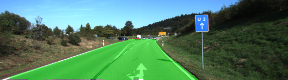
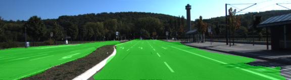

# Semantic Segmentation
### Introduction
In this project, you'll label the pixels of a road in images using a Fully Convolutional Network (FCN). SOlution develop by Juan Luis Vivas Occhipinti

### Setup
##### Frameworks and Packages
Make sure you have the following is installed:
 - [Python 3](https://www.python.org/)
 - [TensorFlow](https://www.tensorflow.org/)
 - [NumPy](http://www.numpy.org/)
 - [SciPy](https://www.scipy.org/)
##### Dataset
Download the [Kitti Road dataset](http://www.cvlibs.net/datasets/kitti/eval_road.php) from [here](http://www.cvlibs.net/download.php?file=data_road.zip).  Extract the dataset in the `data` folder.  This will create the folder `data_road` with all the training a test images.

### Start
##### Implement
Implement the code in the `main.py` module indicated by the "TODO" comments.
The comments indicated with "OPTIONAL" tag are not required to complete.
##### Run
Run the following command to run the project:
```
python main.py
```
**Note** If running this in Jupyter Notebook system messages, such as those regarding test status, may appear in the terminal rather than the notebook.

### Submission
1. Ensure you've passed all the unit tests.
2. Ensure you pass all points on [the rubric](https://review.udacity.com/#!/rubrics/989/view).
3. Submit the following in a zip file.
 - `helper.py`
 - `main.py`
 - `project_tests.py`
 - Newest inference images from `runs` folder  (**all images from the most recent run**)
 
## Project Rubrics

<b>Build the Neural Network</b>
<table>
	<tr>
		<th>Criteria</th>
		<th>Meets Specifications</th>
	</tr>
	<tr>
		<td>Does the project load the pretrained vgg model?</td>
		<td>The function "load_vgg" is implemented correctly.</td>
	</tr>
	<tr>
		<td>Does the project learn the correct features from the images?</td>
		<td>The function "layers" is implemented correctly.</td>
	</tr>
	<tr>
		<td>Does the project optimize the neural network?</td>
		<td>The function "optimized" is implemented correctly.</td>
	</tr>
	<tr>
		<td>Does the project train the neural network?</td>
		<td>The function "train_nn" is implemented correctly.The loss of the network should be printed while the network is training.</td>
	</tr>
</table>

<b>Neural Training</b>
<table>
	<tr>
		<th>Criteria</th>
		<th>Meets Specifications</th>
	</tr>
	<tr>
		<td>Does the project train the model correctly?</td>
		<td>On average, the model decreases loss over time.</td>
	</tr>
	<tr>
		<td>Does the project use reasonable hyperparameters?</td>
		<td>The number of epochs is 50 and the size is set to 5</td>
	</tr>
	<tr>
		<td>Does the project correctly label the road?</td>
		<td>The project labels most pixels of roads close to the best solution. The model doesn't have to predict correctly all the images, just most of them. A solution that is close to best would label at least 80% of the road and label no more than 20% of non-road pixels as road.</td>
	</tr>
</table>

<b>Examples of the road detected by the Neural Network</b>

 
 
 